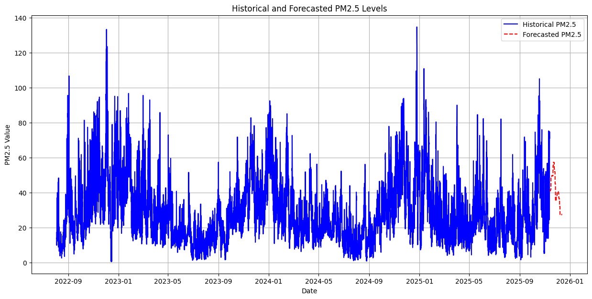
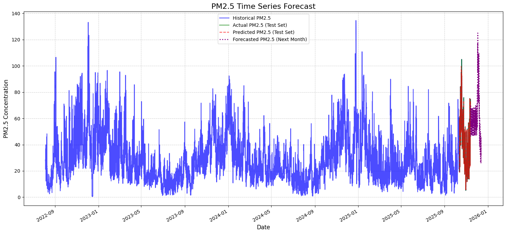
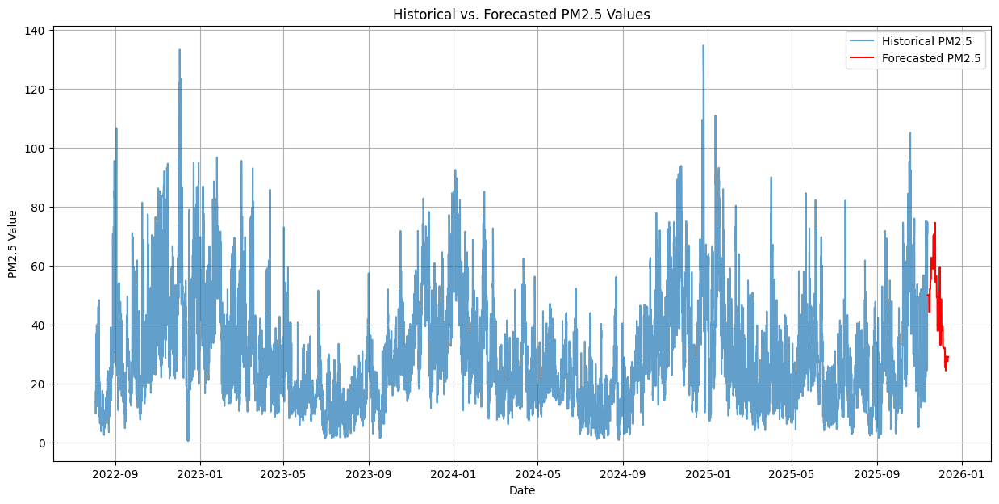

# Air Quality Forecasting with Boosting Algorithms


This project implements time series forecasting for PM2.5 air quality data from Indore using three different boosting algorithms. The goal is to predict future PM2.5 levels to help monitor and understand air quality trends.

##  Dataset

The project uses the `indore_air_quality_date_pm2_5.csv` dataset containing:
- **Date**: Hourly timestamps from August 2022 onwards
- **PM2.5**: Particulate matter concentration (μg/m³)
- **Total Records**: 28,730+ data points

##  Implemented Algorithms

### 1. Gradient Boosting Regressor
- **Notebook**: `gradientboost.ipynb`
- **Features**: Time-based feature extraction (year, month, day, hour)
- **Model**: Sklearn's GradientBoostingRegressor
- **Forecast Period**: Next month prediction



### 2. XGBoost (Extreme Gradient Boosting)
- **Notebook**: `xgboost.ipynb`
- **Features**: Advanced gradient boosting with regularization
- **Model**: XGBoost Regressor
- **Optimization**: Hyperparameter tuning for better performance



### 3. LightGBM (Light Gradient Boosting Machine)
- **Notebook**: `lightGDM.ipynb`
- **Features**: Fast, distributed, high-performance gradient boosting
- **Model**: LightGBM Regressor
- **Advantages**: Memory efficient and faster training



## 🔧 Implementation Details

Each algorithm follows a similar workflow:

1. **Data Preprocessing**
   - Convert date column to datetime objects
   - Set date as DataFrame index
   - Extract time-based features (year, month, day, hour)
   - Handle missing values in PM2.5 data

2. **Feature Engineering**
   - Time-based feature extraction
   - Lag features for temporal dependencies
   - Cyclical encoding for seasonal patterns

3. **Model Training**
   - Split data into training and testing sets
   - Train the respective boosting algorithm
   - Hyperparameter optimization

4. **Forecasting & Visualization**
   - Generate predictions for the next month
   - Create comprehensive visualizations
   - Compare actual vs predicted values

## 📈 Key Features

- **Time Series Analysis**: Comprehensive temporal feature extraction
- **Multiple Algorithms**: Comparison of three state-of-the-art boosting methods
- **Visualization**: Clear, informative forecast plots
- **Scalability**: Efficient handling of large time series datasets

##  Technologies Used

- **Python**: Core programming language
- **Pandas**: Data manipulation and analysis
- **NumPy**: Numerical computations
- **Scikit-learn**: Machine learning library (Gradient Boosting)
- **XGBoost**: Extreme gradient boosting framework
- **LightGBM**: Microsoft's gradient boosting framework
- **Matplotlib/Seaborn**: Data visualization
- **Jupyter Notebooks**: Interactive development environment

##  Requirements

```python
pandas
numpy
scikit-learn
xgboost
lightgbm
matplotlib
seaborn
jupyter
```

##  Getting Started

1. **Clone the repository**
2. **Install required dependencies**
3. **Run the notebooks**:
   - `gradientboost.ipynb` - Gradient Boosting implementation
   - `xgboost.ipynb` - XGBoost implementation
   - `lightGDM.ipynb` - LightGBM implementation

##  Results

The forecast visualizations show:
- **Historical PM2.5 trends**
- **Model predictions for the next month**
- **Confidence intervals** (where applicable)
- **Performance metrics** for model evaluation

Each algorithm demonstrates different strengths in capturing temporal patterns and providing accurate air quality forecasts for environmental monitoring and public health applications.

##  Use Cases

- **Environmental Monitoring**: Track air quality trends
- **Public Health**: Early warning systems for pollution levels
- **Policy Making**: Data-driven environmental regulations
- **Research**: Understanding air pollution patterns

##  Notes

This project demonstrates the application of advanced machine learning techniques to real-world environmental data, providing valuable insights for air quality management and public health protection.